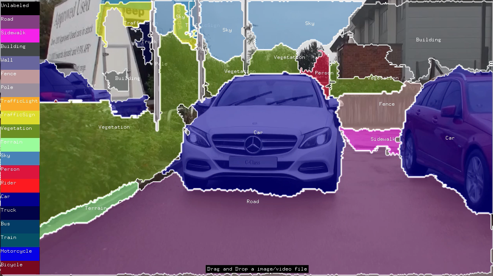

# ofxOpenCvDnnOpenPose


## Description
ofxOpenCvDnnSegmentation is an realtime segmentation addon for openframeworks, which uses opencv dnn modules.

OpenCV v.3.3.1 or upper includes some dnn modules in their own package. Therefore I designed ofxOpenCvDnnSegmentation with OpenCV v.3.3.1 or upper version. It works with [ENET](https://github.com/TimoSaemann/ENet) or [FCN](https://github.com/shelhamer/fcn.berkeleyvision.org) network.




## Usage
See Examples for more details. You can find how to get each class detected segmentation with ofPolyline.
```
void setup()
{
    ofImage img;
    img.load(ofToDataPath("sample.jpg"));
    segmentation.setup(ofToDataPath("dnn/enet-model-best.net"),ofToDataPath("dnn/classlist.txt"));
    segmentation.update(img.getPixels());
}
void draw()
{
    ofBackground(0);
    segmentation.draw(0,0,ofGetWidth(), ofGetHeight());
}

```


## Install
### 1. Clone ofxOpenCvDnnSegmentation to your of/addon directory
    $ git clone https://github.com/TetsuakiBaba/ofxOpenCvDnnSegmentation.git
### 2. Download OpenCV.framework to ofxOpenCvDnnOpenPose/libs directory. 
    $ curl -O http://tetsuakibaba.jp/tmp/opencv2.framework.zip
    $ unzip opencv2.framework.zip
   
Or you may build your own opencv.framework from opencv source. ( https://tetsuakibaba.jp/ws/doku.php?id=opencv_dnn:opencv2.framework )

## Getting Started with Examples/single_image_or_video.
### 1. Download models
    $ sh getModels.sh
### 2. Update single_image_or_video with the projectGenerator. Please be sure to include ofxOpenCvDnnSegmentation and ofxCv

### 3. Run

## Compatibility
- only macOS ( tested on Mojave)
- of version: 0.10.1
- addon: [ofxCv for OF master(0.10.0)](https://github.com/kylemcdonald/ofxCv/)

## Licence
 - [MIT Lisence](https://opensource.org/licenses/MIT)
 - [Video by Pixabay from Pexels](https://www.pexels.com/video/mercedes-c-class-854710/), lisence:Creative Commons Zero.

## Author
[TetsuakiBaba](https://github.com/TetsuakiBaba)

## Reference
1. https://docs.opencv.org/3.4/d4/d88/samples_2dnn_2segmentation_8cpp-example.html
2. [ENET](https://github.com/TimoSaemann/ENet) 
3. [FCN](https://github.com/shelhamer/fcn.berkeleyvision.org)
